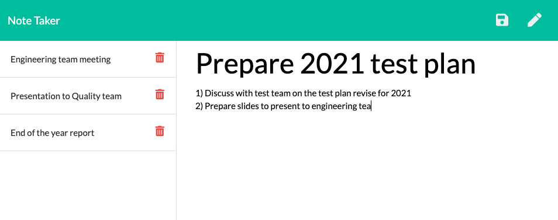

# Homework 10 - Express Homework - Note Taker

## Objective
Create an application that can be used to write, save, and delete notes. This application will use an express backend and save and retrieve note data from a JSON file.

## Acceptance Criteria
- Application should allow users to create and save notes.
- Application should allow users to view previously saved notes.
- Application should allow users to delete previously saved notes.

## Application

### Github Repository URL
https://github.com/thammaraku/homework_10_note_taker

### Heroku Application URL

### Application Screenshot

## Knowledge learned from this assignment
1. Node express and methods usage
2. How to create routes to communicate between frontend and backend 
3. How to deploy application on heroku